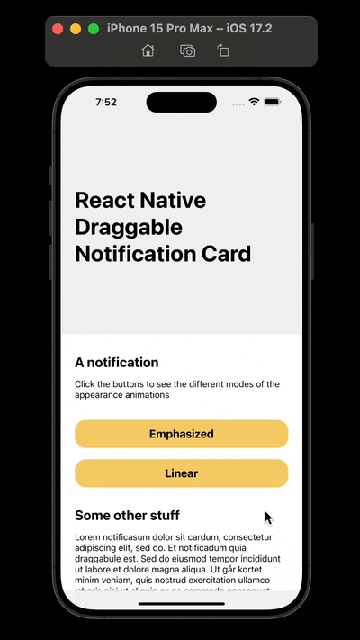

# React Native Swipe Sideways for Contextual Actions



The is the code for the tutorial in the article [React Native and the easy way to get easing 📈 right](https://mikael-ainalem.medium.com/react-native-and-the-easy-way-to-get-easing-right-c4b57f3b5705)

# How to install and run it

```bash
# iOS
yarn && npx pod-install && yarn ios

# or Android
yarn && yarn android
```
